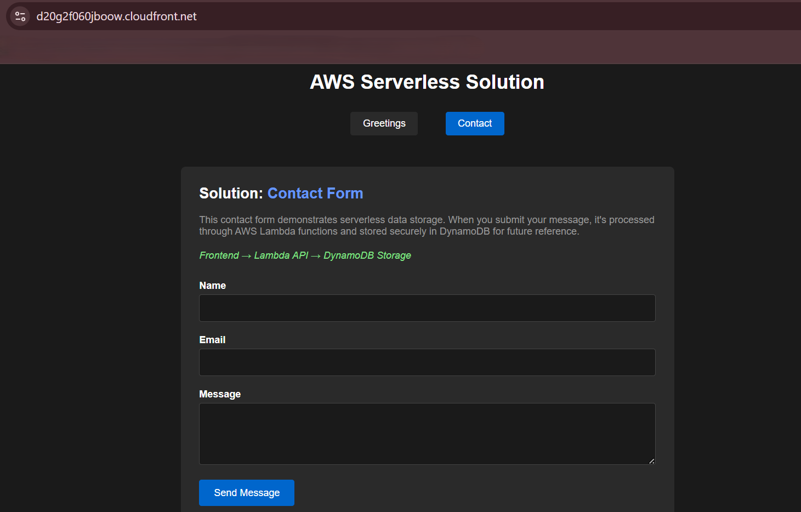
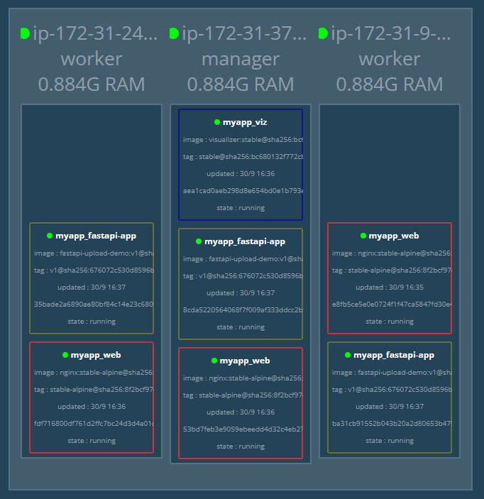

# Inlämningsuppgift 2 - Dennis Byberg

## Introduktion

**Kurs:** Skalbara molnapplikationer (40p)  
**Student:** Dennis Byberg  
**Klass:** CLO24  
**Lärare:** Lars Appel  
**Datum:** 2025-09-30  
**GitHub Repository:** [https://github.com/DennisByberg/assignment2-aws-scalable-hosting](https://github.com/DennisByberg/assignment2-aws-scalable-hosting)

I denna inlämning beskriver jag hur jag implementerat två olika skalara molnlösningar på AWS: en serverless lösning och en containerized lösning med Docker Swarm. Båda lösningarna är designade för att vara högtillgängliga, skalbara och kostnadseffektiva med användning av Infrastructure as Code för automatiserad deployment.

**OBS:** Projekten är för närvarande inte uppe live av säkerhetsskäl då rapporten innehåller skärmdumpar som potentiellt skulle kunna användas för obehörig åtkomst. Kontakta mig gärna om du vill se en live-demonstration av någon av lösningarna.

Istället för att bara bygga en lösning skapade jag två kompletta system som visar fördelarna och utmaningarna med både serverless och containerized arkitekturer.

Den lösningen som är serverless bygger på AWS Lambda, API Gateway, DynamoDB och CloudFront där AWS hanterar all infrastruktur. Den containerized lösningen använder Docker Swarm, EC2, Application Load Balancer och Auto Scaling.

Båda lösningarna använder Terraform för Infrastructure as Code och inkluderar automatiserade deployment-scripts.

## 1. Serverless Lösning

### 1.1 Arkitektur Overview

Serverless-lösningen bygger på en event-driven arkitektur där AWS hanterar all infrastruktur automatiskt. Event-driven betyder att koden bara körs när något händer - som en HTTP-request eller fil-upload - istället för att ha servrar som alltid är igång och väntar. Huvudkomponenterna är:

- **Frontend:** Statiska filer hostade på S3 och distribuerade via CloudFront
- **API:** AWS API Gateway som trigger för Lambda-funktioner
- **Backend:** Lambda-funktioner för business logic
- **Databas:** DynamoDB för datalagring
- **CDN:** CloudFront för global distribution
- **Infrastructure as Code:** Terraform för automatiserad infrastrukturhantering

Hela arkitekturen deployeras och hanteras genom Terraform-moduler som säkerställer reproducerbar infrastruktur. Detta gjorde det väldigt lätt för mig att jobba genom att kunna ta ner och upp min infrastruktur gång på gång utan att behöva göra allt manuellt.

> Översikt av serverless-arkitekturen i AWS Resource Groups som visar alla komponenter samlade:


### 1.2 CloudFront Distribution

CloudFront fungerar som mitt globala content delivery network (CDN). Jag använder det för att distribuera frontend-innehållet från edge locations världen över vilket drastiskt förbättrar prestanda för användare oavsett geografisk plats.

```hcl
resource "aws_cloudfront_distribution" "main" {
  origin {
    domain_name              = var.s3_bucket_regional_domain_name
    origin_id                = "S3-${var.s3_bucket_id}"
    origin_access_control_id = aws_cloudfront_origin_access_control.main.id
  }

  enabled             = true
  is_ipv6_enabled     = true
  default_root_object = "index.html"
}
```

> CloudFront-distribution med status "Deployed" och konfigurerade S3 origins:


### 1.3 Lambda Functions och API Gateway

Lambda-funktionerna hanterar all backend-logik. Jag implementerade separata funktioner för greetings och contact form som visar två olika användningsfall:

```python
import boto3
from datetime import datetime

def lambda_handler(event, context):
    # Connect to DynamoDB
    db = boto3.resource('dynamodb')
    table = db.Table('Contacts')

    # Create timestamp
    dateTime = (datetime.now()).strftime("%Y-%m-%d %H:%M:%S")

    try:
        payload = json.loads(event['body'])

        # Add row to DynamoDB
        table.put_item(
            Item={
                'timestamp': dateTime,
                'name': payload['name'],
                'email': payload['email'],
                'message': payload['msg']
            }
        )

        return {
            'statusCode': 200,
            'headers': {
                'Access-Control-Allow-Origin': '*',
                'Content-Type': 'application/json'
            },
            'body': json.dumps({'message': 'Success'})
        }
```

CORS-headers är kritiska för att frontend ska kunna kommunicera med API:et. Utan dessa headers blockerar webbläsaren requests från olika domäner vilket var ett ganska stort problem under min utveckling av projektet.

> Lambda-funktioner med status och senaste exekveringar:


> API Gateway REST API:


### 1.4 DynamoDB för Datalagring

Jag valde DynamoDB för dess serverless natur och automatiska skalning. Tabellerna skapas med PAY_PER_REQUEST billing för att minimera kostnader:

```hcl
resource "aws_dynamodb_table" "greetings_table" {
  name         = "${var.project_name}-greetings"
  billing_mode = "PAY_PER_REQUEST"
  hash_key     = "greeting"

  attribute {
    name = "greeting"
    type = "S"
  }
}
```

PAY_PER_REQUEST betyder att jag bara betalar för faktiska läs och skrivoperationer vilket är riktigt nickt för en applikation med varierande trafik.

> DynamoDB-tabeller med item count och capacity inställningar:


### 1.5 Automatiserad Deployment

Jag skapade ett deployment-script som automatiserar hela processen:

```bash
# Deploy infrastructure
deploy_infrastructure() {
    cd ../terraform
    terraform apply -auto-approve
    cd ../scripts
}

# Upload static files to S3
upload_frontend() {
    mkdir -p /tmp/serverless-build
    cp -r ../app/static /tmp/serverless-build/

    sed "s|{{ api_gateway_url }}|${API_GATEWAY_URL}|g; s|{{ contact_api_url }}|${CONTACT_API_URL}|g" \
        ../app/templates/index.html > /tmp/serverless-build/index.html

    aws s3 sync /tmp/serverless-build/ s3://${S3_BUCKET_NAME}/ --delete
}
```

Det smarta med scriptet är att det ersätter placeholder-värden i HTML-filen med faktiska API Gateway URLs från Terraform outputs. Detta gör deployment helt automatiserat utan manuella steg, detta gjorde det möjligt för mig att i ett knapptryck deploya hela stacken från scratch.  
**OBS:** _Detta är bara en liten del av scriptet, hela scriptet hittas i mitt repo._

> Terminal output från deployment-script med Terraform apply:


> Körande serverless-applikation tillgänglig via CloudFront (Greetings Tab):


> Körande serverless-applikation tillgänglig via CloudFront (Contact Tab):



## 2. Containerized Solution

### 2.1 Docker Swarm Cluster Design

Containerized-lösningen bygger på ett Docker Swarm-kluster som består av:

- **1x Manager Node:** Hanterar orkestrerning och deployment
- **2-6x Worker Nodes:** Auto Scaling Group som justerar kapacitet baserat på CPU-belastning
- **Application Load Balancer:** Distribuerar trafik över alla noder
- **FastAPI Application:** Containerized Python-applikation med image upload

Detta ger mig full kontroll över runtime-miljön medan jag fortfarande får fördelarna av automatisk skalning och lastbalansering.

> EC2-instanser i Docker Swarm-klustret med manager och workers:


### 2.2 Auto Scaling Group Configuration

Auto Scaling Group hanterar worker-noderna och skalar automatiskt baserat på CPU-användning:

```hcl
resource "aws_autoscaling_group" "worker_asg" {
  name                = "${var.project_name}-workers"
  vpc_zone_identifier = var.subnet_ids

  target_group_arns = [
    var.target_group_arns.nginx,
    var.target_group_arns.fastapi
  ]

  health_check_type         = "ELB"
  health_check_grace_period = 300

  min_size         = 2
  max_size         = 6
  desired_capacity = 2
}
```

Jag satte minimum till 2 och maximum till 6 för att hantera trafikspikningar. ELB health checks säkerställer att bara friska instanser får trafik.

> Auto Scaling Group med capacity inställningar och scaling limits:


### 2.3 Application Load Balancer

ALB distribuerar trafik över flera portar för olika tjänster:

```hcl
# ALB Listener för FastAPI
resource "aws_lb_listener" "fastapi" {
  load_balancer_arn = aws_lb.main.arn
  port              = "8001"
  protocol          = "HTTP"

  default_action {
    type             = "forward"
    target_group_arn = aws_lb_target_group.fastapi.arn
  }
}
```

Load Balancer kör på port 80 för Nginx, 8080 för Visualizer och 8001 för FastAPI.

> Application Load Balancer med target groups och health status:


### 2.4 Container Registry med ECR

Jag använder AWS ECR för att lagra Docker images säkert:

```bash
# Build and push multi-arch image
build_and_push_image() {
    cd $APP_DIR
    docker buildx build \
        --platform linux/amd64,linux/arm64 \
        -t ${REPO_URI}:${IMAGE_TAG} \
        -t ${REPO_URI}:latest \
        --push \
        .
}
```

Multi-arch builds säkerställer att imagen fungerar på både x86 och ARM-processorer. Detta ger mig flexibilitet att använda olika instanstyper beroende på kostnad och prestanda.

> ECR repository med Docker images och tags:


### 2.5 Docker Swarm Initialization

Manager-noden initialiserar Swarm-klustret automatiskt via user data script:

```bash
# Initialize Docker Swarm
MANAGER_IP=$(hostname -I | awk '{print $1}')
docker swarm init --advertise-addr $MANAGER_IP

# Get join token and save to SSM
WORKER_TOKEN=$(docker swarm join-token worker -q)
aws ssm put-parameter \
    --name "/docker-swarm/worker-token" \
    --value "$WORKER_TOKEN" \
    --region eu-north-1
```

Worker-noder hämtar join token från AWS Systems Manager Parameter Store och ansluter automatiskt till klustret. Detta eliminerar manuella steg vid skalning vilket gör det enkelt för mig som utvecklare att hantera.

> Docker Swarm Visualizer som visar kluster-topologi:



> FastAPI-applikation tillgänglig via Application Load Balancer:


### 2.6 Hybrid Storage

FastAPI-applikationen implementerar smart hybrid storage som kombinerar AWS S3 med lokal lagring:

```python
# Handle image upload and determine image_url
if aws_status["s3_available"]:
    file_key = f"images/{post_id}.jpg"
    upload_success = upload_image_s3(file_content, file_key)
    if upload_success:
        image_url = f"https://{S3_BUCKET_NAME}.s3.{AWS_REGION}.amazonaws.com/{file_key}"
    else:
        LOCAL_IMAGES[post_id] = file_content
        image_url = f"/image/{post_id}"
else:
    LOCAL_IMAGES[post_id] = file_content
    image_url = f"/image/{post_id}"
```

Om AWS-tjänster inte är tillgängliga fortsätter applikationen att fungera med lokal lagring. Detta gjorde att jag kunde leka och utveckla min frontend väldigt enkelt utan att ha sidan live.

## 3. Infrastructure as Code med Terraform

### 3.1 Modulär Struktur

Jag organiserade Terraform-koden i moduler för återanvändbarhet och underhåll:

```
terraform/
├── main.tf
├── variables.tf
├── outputs.tf
└── modules/
    ├── storage/
    ├── compute/
    ├── networking/
    ├── iam/
    └── cdn/
```

Modulär struktur gör koden lättare att förstå, testa och återanvända. Varje modul har ett specifikt ansvar vilket följer single responsibility principle.

### 3.2 Security Groups Implementation

Jag implementerade säkerhet med specifika Security Groups för varje komponent:

```hcl
# Security Group för Docker Swarm instances
resource "aws_security_group" "docker_swarm" {
  name_prefix = "${var.project_name}-instances-"
  description = "Security group for Docker Swarm instances"

  # SSH access
  ingress {
    from_port   = 22
    to_port     = 22
    protocol    = "tcp"
    cidr_blocks = ["0.0.0.0/0"]
  }

  # Swarm Management
  ingress {
    from_port = 2377
    to_port   = 2377
    protocol  = "tcp"
    self      = true
  }
}
```

Principle of least privilege tillämpas vilket betyder att varje komponent har bara de behörigheter som absolut krävs för funktionalitet. Detta gjorde min kod väldigt clean och lättläst.

> Security Groups med inbound och outbound rules:


### 3.3 IAM Roles och Policies

Jag skapade specifika IAM-roller för olika komponenter:

```hcl
resource "aws_iam_role_policy" "docker_swarm_policy" {
  name = "${var.project_name}-policy"
  role = aws_iam_role.docker_swarm_role.id

  policy = jsonencode({
    Version = "2012-10-17"
    Statement = [
      {
        Effect = "Allow"
        Action = [
          "ecr:GetAuthorizationToken",
          "ecr:BatchCheckLayerAvailability",
          "ecr:GetDownloadUrlForLayer",
          "ecr:BatchGetImage"
        ]
        Resource = "*"
      }
    ]
  })
}
```

Detta säkerställer att EC2-instanserna kan interagera med ECR och andra AWS-tjänster utan att exponera credentials. Jag hade stora problem med detta och för att vara en så liten del av koden så gjorde det stor skillnad.

## 4. Deployment Automation

### 4.1 Bash Scripts med UX

Jag utvecklade deployment-scripts med fokus på användarupplevelse:

```bash
#!/bin/bash
set -e
source "$(dirname "$0")/utils.sh"

# Execute deployment process
print_info "Deploying infrastructure..."
(deploy_infrastructure) & spinner $!

print_info "Building FastAPI image locally..."
(build_fastapi_image) & spinner $!

print_info "Pushing FastAPI image to ECR..."
(push_fastapi_image) & spinner $!

print_success "Deployment completed!"
```

Spinner-funktionaliteten ger visuell feedback medan långa operationer körs i bakgrunden, vilket förbättrar användarupplevelsen mycket enligt mig som gammal frontendare. Användaren ser att något händer istället för att bara vänta om något kanske har låst sig.

### 4.2 First-time Deployment Script

För första gången man deployer infrastrukturen skapade jag ett komplett script som hanterar hela processen:

```bash
#!/bin/bash
set -e
source "$(dirname "$0")/../../../shared/scripts/utils.sh"

# Execute deployment process
print_info "Deploying infrastructure..."
(deploy_infrastructure) & spinner $!

print_info "Building FastAPI image locally..."
(build_fastapi_image) & spinner $!

print_info "Pushing FastAPI image to ECR..."
(push_fastapi_image) & spinner $!

print_info "Deploying basic stack to Docker Swarm..."
(deploy_basic_stack) & spinner $!

print_success "Deployment completed!"
```

Scriptet hanterar allt från Terraform infrastructure deployment till Docker image builds och Swarm deployment. Det ger tydlig feedback genom hela processen.

> Terminal output från första deployment med alla steg:


Detta gör det enkelt att komma igång direkt efter deployment utan att behöva leta efter endpoints manuellt.

### 4.3 Auto-incrementing Image Tags

För att hantera versioning implementerade jag auto-incrementing image tags, detta ska jag vara ärlig med att säga att jag tog hjälp av AI för att skapa då koden är ganska oläsbar. Men det den gör är att kolla vilken siffra vi använder i våran version, om den hittar en siffra så kommer den öka med ett till nästa version.

```bash
# Auto-increment image tag if not provided
determine_image_tag() {
    if [ -z "$IMAGE_TAG" ]; then
        LATEST_TAG=$(aws ecr describe-images \
            --repository-name $REPO_NAME \
            --region $AWS_REGION \
            --query 'imageDetails[].imageTags[]' \
            --output text 2>/dev/null | \
            tr '\t' '\n' | \
            grep -E '^v[0-9]+$' | \
            sed 's/v//' | \
            sort -n | \
            tail -1)

        if [ -z "$LATEST_TAG" ]; then
            IMAGE_TAG="v1"
        else
            NEXT_VERSION=$((LATEST_TAG + 1))
            IMAGE_TAG="v${NEXT_VERSION}"
        fi
    fi
}
```

## 5. Monitoring och Health Checks

### 5.1 CloudWatch Integration

Båda lösningarna integrerar med CloudWatch för monitoring:

```hcl
resource "aws_cloudwatch_metric_alarm" "cpu_high" {
  alarm_name          = "${var.project_name}-cpu-high"
  comparison_operator = "GreaterThanThreshold"
  evaluation_periods  = "2"
  metric_name         = "CPUUtilization"
  namespace           = "AWS/EC2"
  period              = "120"
  statistic           = "Average"
  threshold           = 50
  alarm_actions       = [aws_autoscaling_policy.scale_up.arn]
}
```

Jag satte threshold till 50% CPU för att ge tillräckligt med marginal för nya instanser att starta innan systemet blir överbelastat.

> CloudWatch CPU-metrics för Auto Scaling Group med scaling events:


### 5.2 Health Checks

Jag konfigurerade hälsokontroller för att säkerställa att endast friska instanser tar emot trafik:

```hcl
resource "aws_lb_target_group" "fastapi" {
  name     = "${var.project_name}-fastapi"
  port     = 8001
  protocol = "HTTP"
  vpc_id    = aws_vpc.main.id

  health_check {
    path                = "/health"
    interval             = 30
    timeout              = 5
    healthy_threshold   = 2
    unhealthy_threshold = 2
  }
}
```

FastAPI-applikationen implementerar en `/health` endpoint som returnerar statusen för alla beroenden inklusive AWS-tjänster.

> Health check på sidan som är live:


## 6. Kostnadsanalys

### 6.1 Free Tier Optimization

Jag designade båda lösningarna för att maximera Free Tier-fördelarna:

- t3.micro EC2-instanser för containerized solution
- PAY_PER_REQUEST DynamoDB billing
- Minimal CloudFront usage för utveckling

Detta gör att kostnaderna håller sig låga under utveckling och testning vilket är perfekt för mig som student.

## 7. Säkerhet

### 7.1 Secrets Management

Jag använde AWS Systems Manager Parameter Store för att hantera känslig information som database credentials och API keys istället för att hårdkoda dem i koden.

```bash
# Save Swarm join token securely
aws ssm put-parameter \
    --name "/docker-swarm/worker-token" \
    --value "$WORKER_TOKEN" \
    --type "SecureString"
```

Detta säkerställer att känslig information inte exponeras i koden eller logs.

## 8. Avslut och Reflektion

### 8.1 Vad jag skulle göra annorlunda

I efterhand skulle jag implementera mer omfattande monitoring med CloudWatch dashboards för båda lösningarna. Jag skulle också använda AWS Secrets Manager istället för Parameter Store för bättre rotation av secrets.

På grund av tidsbrist hann jag inte skapa ett arkitekturdiagram för containerized-lösningen som jag gjorde för serverless-lösningen. För framtida projekt skulle jag prioritera att skapa dessa tidigt i utvecklingsprocessen för bättre dokumentation och förståelse.

För deployment skulle jag ha velat implementera GitOps med GitHub Actions för automatisk deployment vid code commits, men för denna inlämning valde jag att fokusera på arkitekturen istället då det hade tagit avsevärt längre tid att försöka få med en CI/CD pipeline, och den tiden fanns tyvärr inte.

### 8.2 Slutsats

Det här projektet har lärt mig massor om hur olika lösningar fungerar i praktiken. Serverless är riktigt bra när man har en app som inte används jättemycket eller har oregelbunden trafik, då betalar man bara när folk faktiskt använder den. Containerized lösningar ger en mer kontroll över hur allt körs och man vet vad man kan förvänta sig.

Om jag skulle bygga en enkel hemsida eller blogg skulle jag definitivt välja serverless eftersom det är enklare och billigare. Men om jag jobbar med något mer komplext där jag behöver specifika inställningar eller bibliotek, då är containers "the way to go" enligt mig.

Jag tycker att jag har lyckats implementera två helt olika arkitekturer som båda faktiskt fungerar. Det var riktigt kul att se hur samma problem kan lösas på så olika sätt.

Infrastructure as Code med Terraform var en game-changer för mig. Att kunna skriva kod som skapar hela infrastrukturen betyder att jag kan experimentera och testa utan att oroa mig för att förstöra något. Om något går fel är det bara att köra destroy och börja om igen. Jag sparar både på min tid och motivation.

Deployment-scripten med spinner-animationer kanske låter som en småsak, men det gjorde verkligen skillnad när jag satt och väntade på att allt skulle deployas. Som frontendare uppskattar jag när saker ser bra ut och ger feedback.

Som ny inom detta var det väldigt lärorikt att faktiskt bygga båda varianterna istället för att bara läsa om dem. Nu känner jag att jag kan sitta här på min stol och jämföra de två lösningarna på riktigt.
