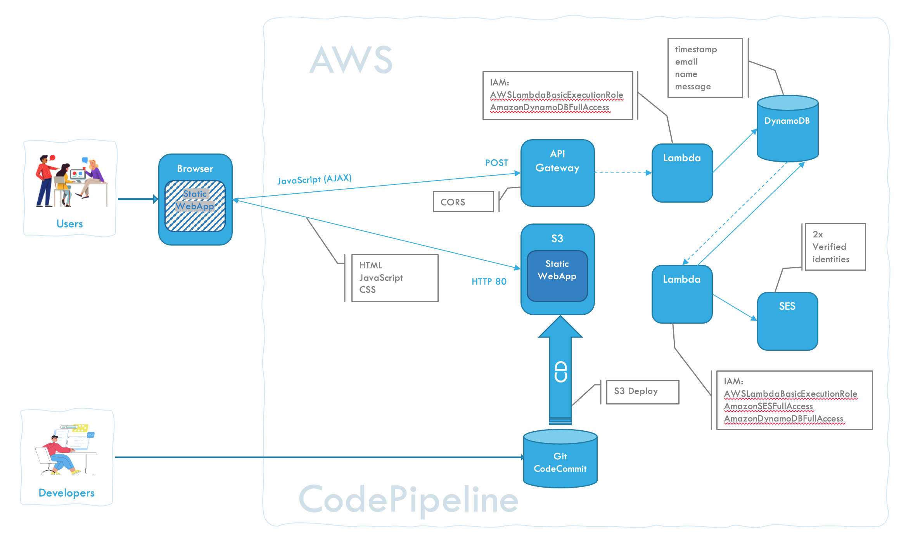

# Create a Serverless Web App on AWS: Contact Form

## Introduction

This tutorial guides you through creating a serverless web application with a contact form on AWS. The application uses AWS S3 for hosting the front-end, AWS Lambda and API Gateway for backend processing and DynamoDB to store information. When contact information is entered in the form it will be saved in DynamoDB and an email is sent, using SES, as a notification. We'll walk through each step, ensuring you verify the functionality at each stage.

## Architecture Overview

The application follows this flow:

- **Frontend**: Contact form hosted on S3
- **API**: API Gateway triggers Lambda functions
- **Backend**: Lambda functions handle form submission and notifications
- **Database**: DynamoDB stores contact information
- **Email**: SES sends notification emails
- **CI/CD**: CodePipeline automates deployment

## Method

1. Add a DynamoDB table for contacts
2. Configure SES (Simple Email Service)
3. Create Lambda functions for DynamoDB and SES
4. Create API Gateway
5. Develop the web page with contact form
6. Set up S3 for static website hosting
7. Set up CodePipeline for CI/CD

## Prerequisites

- An AWS account. If you don't have one, [sign up here](https://aws.amazon.com/)
- Basic familiarity with the AWS Management Console, AWS CLI, Python, HTML, and JavaScript

## Overview



---

## Step 1: Add a DynamoDB Table For Contacts

### Create a DynamoDB Table

1. Navigate to the DynamoDB service and click on "Create Table"
2. **Table name**: `Contacts`
3. **Primary key**: `timestamp`
4. Click on "Create Table"

---

## Step 2: Configure SES (Amazon Simple Email Service)

In order to send and receive emails for this tutorial you need to register two identities (email addresses) and validate these.

### Create Identity

1. Navigate to SES and select **Identities** in the left menu
2. Press **Create identity**
3. Choose **Email address**
4. Enter a valid email address
5. Press **Create identity**
6. **Repeat** the above steps for the second email address

### Confirm the Email Addresses

1. You will receive emails with a confirmation link
2. Follow the link to confirm the email addresses

---

## Step 3: Create Lambda Functions

We will need two lambda functions. One that writes the contact information to the DynamoDB and a second one that sends a notification email, via SES, when the DynamoDB is updated with new information.

### Create an IAM Role for DynamoDB Access

1. Navigate to the IAM service in the AWS Management Console
2. Choose **Roles** in the left menu
3. Click **Create role**
4. Select **AWS service**
5. **Service or use case**: Lambda
6. Press **Next**
7. Check: `AWSLambdaBasicExecutionRole`
8. Check: `AmazonDynamoDBFullAccess`
9. Press **Next**
10. **Role name**: `LambdaRoleToAccessDynamoDB`
11. Press **Create role**

### Create Lambda Function for Writing to DynamoDB

1. Navigate to the Lambda service in the AWS Management Console
2. Click "Create function" and choose "Author from scratch"
3. **Function name**: `AddContactInfo`
4. **Runtime**: Python
5. Expand "Change default execution role" and choose **Use an existing role**
6. **Existing role**: `LambdaRoleToAccessDynamoDB`
7. Press **Create function**

### Lambda Function Code

```python
import json                     # used for converting json strings to Python objects
import boto3                    # handles AWS
from datetime import datetime   # used for creating the timestamp

def lambda_handler(event, context):
    # Connect to the DynamoDB table
    db = boto3.resource('dynamodb')
    table = db.Table('Contacts')

    # Create the time stamp
    dateTime = (datetime.now()).strftime("%Y-%m-%d %H:%M:%S")

    try:
        # Get the contact info from the request
        payload = json.loads(event['body'])

        # Add a row with contact info to DynamoDB
        table.put_item(
            Item={
                'timestamp': dateTime,
                'name': payload['name'],
                'email': payload['email'],
                'message': payload['msg']
            }
        )

        # Return success
        return {
            'statusCode': 200,
            'body': json.dumps('Successfully saved contact info!'),
            'headers': {
                "Access-Control-Allow-Origin": "*",
                "Access-Control-Allow-Credentials": True,
            }
        }

    except:
        # Return error
        return {
            'statusCode': 400,
            'body': json.dumps('Error saving contact info'),
            'headers': {
                "Access-Control-Allow-Origin": "*",
                "Access-Control-Allow-Credentials": True,
            }
        }
```

Press **Deploy**

### ✅ Verify Lambda Function

1. Use the "Test" feature in the Lambda console
2. Press "Test"
3. **Test event action**: Create new event
4. **Event name**: `AddContactInfoToDynamoDB`

**Event JSON:**

```json
{
  "httpMethod": "POST",
  "body": "{\"name\": \"Darth\", \"email\": \"darth.vader@email.com\", \"msg\": \"I am your ...\"}"
}
```

5. Press "Save"
6. Press "Test" (again)

**Expected Response:**

```json
{
  "statusCode": 200,
  "body": "\"Successfully saved contact info!\""
}
```

7. Verify that there is a new record in the DynamoDB table

### Create API Gateway

1. Press "+ Add trigger" in the Function Overview Diagram
2. Choose the API Gateway service
3. Create a new REST API
4. **Security**: Open
5. Press "Add"

### Enable CORS

1. Navigate to the API Gateway → Resources (`/AddContactInfo`)
2. Click on "Enable CORS"
3. Press "Save"

⚠️ Make sure CORS is also added to the response headers in the lambda function

### ✅ Verify API Gateway

1. Navigate to the API Gateway service and select the newly created API
2. Go to the **Test** tab
3. **Method type**: POST

**Request body:**

```json
{
  "name": "Yoda",
  "email": "yoda@email.com",
  "msg": "The greatest teacher, failure is."
}
```

### Create IAM Role for SES Access

1. Navigate to the IAM service in the AWS Management Console
2. Choose **Roles** in the left menu
3. Click **Create role**
4. Select **AWS service**
5. **Service or use case**: Lambda
6. Press **Next**
7. Check: `AWSLambdaBasicExecutionRole`
8. Check: `AmazonSESFullAccess`
9. Check: `AmazonDynamoDBFullAccess`
10. Press **Next**
11. **Role name**: `LambdaRoleToAccessSES`
12. Press **Create role**

### Create Lambda Function for Email Notifications

1. Navigate to the Lambda service in the AWS Management Console
2. Click "Create function" and choose "Author from scratch"
3. **Function name**: `SendContactInfoEmail`
4. **Runtime**: Python
5. Expand "Change default execution role" and choose **Use an existing role**
6. **Existing role**: `LambdaRoleToAccessSES`
7. Press **Create function**

### Email Lambda Function Code

⚠️ **Replace `<FROM_EMAIL>` and `<TO_EMAIL>` with your verified SES email addresses!**

```python
import json
import boto3

# Initialize the DynamoDB client
dynamodb = boto3.resource('dynamodb')
table = dynamodb.Table('Contacts')  # Replace with your DynamoDB table name

def lambda_handler(event, context):
    # Scan the DynamoDB table
    result = table.scan()
    items = result['Items']

    ses = boto3.client('ses')

    body = f"""
        Contact Information:
        {items}
        """

    ses.send_email(
        Source = '<FROM_EMAIL>',
        Destination = {
            'ToAddresses': [
                '<TO_EMAIL>'
            ]
        },
        Message = {
            'Subject': {
                'Data': 'Contact Info Notification',
                'Charset': 'UTF-8'
            },
            'Body': {
                'Text':{
                    'Data': body,
                    'Charset': 'UTF-8'
                }
            }
        }
    )

    return {
        'statusCode': 200,
        'body': json.dumps('Successfully sent email from Lambda using Amazon SES')
    }
```

Press **Deploy**

### ✅ Verify Email Lambda Function

1. Use the "Test" feature in the Lambda console
2. Press "Test"
3. **Test event action**: Create new event
4. **Event name**: `SendContactInfoEmail`
5. **Event JSON**: Empty
6. Press "Save"
7. Press "Test" (again)

**Expected Response:**

```json
{
  "statusCode": 200,
  "body": "\"Successfully sent email from Lambda using Amazon SES\""
}
```

8. Check your inbox (also check the spam directory)

### Add DynamoDB as Trigger for Email Lambda Function

1. Press "+ Add trigger" in the Function Overview Diagram
2. Choose the **DynamoDB** service
3. **DynamoDB table**: `Contacts`
4. Press **Add**

### ✅ Verify Complete Flow

1. Navigate to the `AddContactInfo` lambda function
2. Use the "Test" feature in the Lambda console
3. Press "Test"
4. Check the entry in the DynamoDB table and that you also receive an email

---

## Step 4: Develop a Web Page with a Contact Form

Create an `index.html` file with the following content:

⚠️ **Replace `<API_ENDPOINT>` with your actual API Gateway endpoint URL!**

```html
<!DOCTYPE html>
<html>
  <head>
    <title>Contact Form</title>
    <!-- Add Bootstrap CSS -->
    <link
      rel="stylesheet"
      href="https://maxcdn.bootstrapcdn.com/bootstrap/4.5.0/css/bootstrap.min.css"
    />
  </head>
  <body>
    <div class="container">
      <h1>Contact Form</h1>
      <form id="contactForm" method="POST">
        <div class="form-group">
          <label for="name">Name:</label>
          <input type="text" class="form-control" id="name" name="name" required />
        </div>

        <div class="form-group">
          <label for="email">Email:</label>
          <input type="email" class="form-control" id="email" name="email" required />
        </div>

        <div class="form-group">
          <label for="msg">Message:</label>
          <textarea
            class="form-control"
            id="msg"
            name="msg"
            rows="4"
            cols="50"
            required
          ></textarea>
        </div>

        <input type="submit" class="btn btn-primary" value="Submit" />
      </form>
    </div>

    <!-- Add Bootstrap JS and jQuery -->
    <script src="https://code.jquery.com/jquery-3.5.1.slim.min.js"></script>
    <script src="https://cdn.jsdelivr.net/npm/bootstrap@4.5.0/dist/js/bootstrap.min.js"></script>

    <script>
      ApiUrl = '<API_ENDPOINT>';

      // Add event listener to form. Intercept form submission
      document.getElementById('contactForm').addEventListener('submit', function (event) {
        event.preventDefault(); // Prevent form submission

        // Retrieve form data
        var formData = {
          name: document.getElementById('name').value,
          email: document.getElementById('email').value,
          msg: document.getElementById('msg').value,
        };

        // Convert JavaScript object to JSON string
        var payload = JSON.stringify(formData);

        // Send payload to the API (asynchronously)
        fetch(ApiUrl, {
          method: 'POST',
          body: payload,
        })
          .then((response) => {
            if (response.ok) {
              alert('Form submitted successfully');
            } else {
              alert('Form submission failed');
            }
          })
          .catch((error) => {
            console.error('An error occurred:', error);
          });
      });
    </script>
  </body>
</html>
```

### ✅ Verify Contact Form

1. Use your web browser and go to `file://<path>/index.html`
2. Fill out and submit the contact form
3. Check the record in DynamoDB
4. Check that you received an email

---

## Step 5: Set Up S3 for Static Website Hosting

### Create an S3 Bucket

1. Navigate to the S3 service in the AWS Management Console
2. Click "Create bucket"
3. **Bucket name**: `contacts<date><time>` (The bucket name must be unique)
4. Click "Create bucket"

### Upload the Web Page

Upload the `index.html` file to your S3 bucket.

### Enable Static Website Hosting

1. Go to the **Properties** tab
2. Enable "Static website hosting" in the bucket properties
3. **Index document**: `index.html`
4. Press "Save changes"

### Configure Public Access

1. Go to the **Permissions** tab
2. Uncheck "Block public access" in the bucket permissions
3. Press "Save changes"

### Add Bucket Policy

⚠️ **Change the bucket name in the policy below!**

```json
{
  "Version": "2012-10-17",
  "Statement": [
    {
      "Sid": "PublicAccessGetObject",
      "Principal": "*",
      "Effect": "Allow",
      "Action": ["s3:GetObject"],
      "Resource": ["arn:aws:s3:::<bucket_name>/*"]
    }
  ]
}
```

Press "Save changes"

### ✅ Verify S3 Hosting

1. Access the bucket URL (provided in the static website hosting settings) to ensure your web page loads
2. Fill in the contact form and verify that the information is stored in DynamoDB and that you receive a notification email

---

## Step 6: Set Up a CodePipeline

> **Reference**: [AWS CodePipeline Tutorial](https://docs.aws.amazon.com/codepipeline/latest/userguide/tutorials-s3deploy.html)

### Create a CodeCommit Git Repository

1. Navigate to CodeCommit
2. **Name**: `ContactForm`
3. Commit the `index.html` file to the repo

### Create CodePipeline

1. Navigate to CodePipeline
2. **Pipeline name**: `ContactPipeline`
3. Press **Next**

#### Source Stage

- **Source provider**: AWS CodeCommit
- **Repository name**: `ContactForm`
- **Branch name**: `main`
- Press **Next**

#### Build Stage

- Press **Skip build stage**

#### Deploy Stage

- **Deploy provider**: Amazon S3
- **Bucket**: `contactform...` (your bucket name)
- ✅ Check **Extract file before deploy** (important!)
- Press **Next**

4. Press **Create pipeline**

---

## Final Thoughts

This tutorial demonstrates a step-by-step approach to creating a serverless web application using AWS services. By following these steps, you should have a functional web app with a contact form that saves the contact info in a DynamoDB and sends a notification email.

## Cleanup

Remove resources you no longer need to avoid unnecessary costs:

- **S3** bucket and contents
- **Lambda functions** (AddContactInfo, SendContactInfoEmail)
- **API Gateway**
- **DynamoDB** table (Contacts)
- **IAM Roles** (LambdaRoleToAccessDynamoDB, LambdaRoleToAccessSES)
- **CodeCommit** repository
- **CodePipeline**
- **SES** identities

---

**Happy Serverless Developing on AWS!** 🚀
